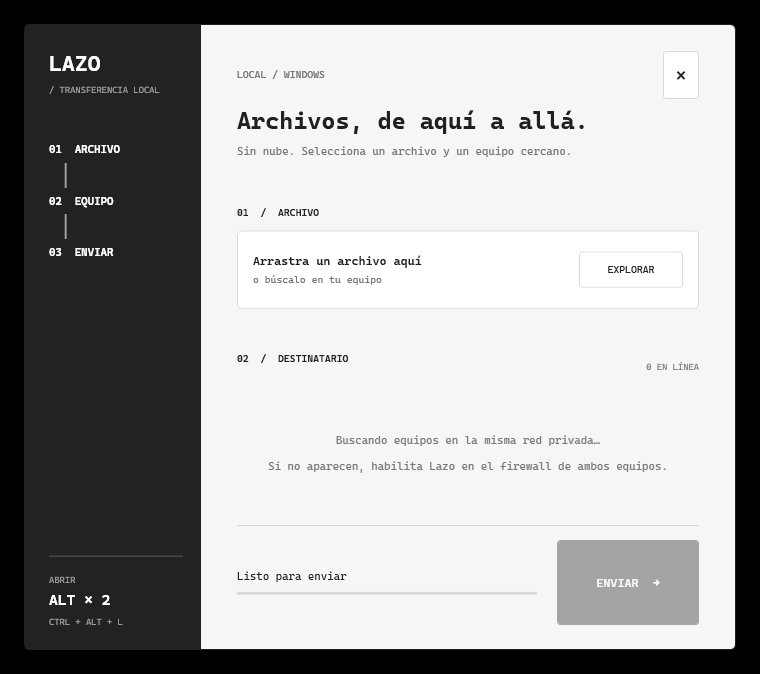

# Lazo

Transferencia de archivos entre equipos Windows de la misma subred. La aplicación permanece en la bandeja; se abre con **doble toque de Alt izquierdo** o **Ctrl+Alt+L**.



## Uso

1. Abre `Lazo.exe` en ambos equipos.
2. Selecciona o arrastra un archivo, elige el equipo y pulsa **Enviar**.
3. En el otro equipo aparece una ventana sobre las demás. La persona receptora acepta o rechaza; la solicitud caduca después de 90 segundos.
4. El archivo aceptado se guarda en `Descargas\Lazo`. Una barra muestra el progreso; la ventana se repliega al terminar.

Cerrar la ventana principal la oculta en la bandeja. **Salir** en el menú de la bandeja detiene la aplicación.

## Instalación en otro equipo

El paquete de `dist/Lazo-0.1.0.zip` contiene el ejecutable y la configuración opcional del firewall. Descomprime la carpeta en una ubicación permanente. En **cada equipo receptor**, abre PowerShell como administrador y ejecuta `enable-private-network.ps1` desde esa carpeta si Windows no ha permitido ya la conexión entrante. La regla se limita al perfil **Privado** y a la subred local. Mantén la red de Windows configurada como privada.

No se usan carpetas compartidas ni permisos SMB. Lazo usa descubrimiento UDP en el puerto `48351` y transferencia TCP en `48352`. Los nombres de equipo provienen de los anuncios de Lazo, no de una lista general de dispositivos de Windows. Ambos equipos deben tener Lazo abierto y estar en la misma subred IPv4; el aislamiento de clientes Wi‑Fi puede impedir la comunicación.

Compatible con Windows 10 y 11 con .NET Framework 4.8 o superior. Esta versión se probó en Windows 11; la prueba entre dos equipos físicos con Windows 10/11 queda pendiente.

## Compilar y probar

No requiere paquetes NuGet ni SDK de .NET. En un equipo con .NET Framework 4.8 y PowerShell:

```powershell
.\scripts\build.ps1 -Release
.\scripts\test-network.ps1
.\scripts\package.ps1
```

El ejecutable queda en `bin/Lazo.exe` y el paquete en `dist/Lazo-0.1.0.zip`. La prueba de red hace una transferencia real a la IP privada del propio equipo y verifica el archivo recibido sin tocar Descargas.

## Límites de esta primera versión

- Un archivo por envío, hasta 20 GB; una recepción activa a la vez.
- El protocolo todavía **no cifra ni autentica** a los equipos. Los nombres anunciados pueden suplantarse. Úsalo solo en redes locales de confianza y verifica el remitente y su IP antes de aceptar archivos.
- Doble Alt no bloquea el comportamiento normal de Alt en otras aplicaciones; algunas pueden activar su menú tras el primer toque. `Ctrl+Alt+L` queda como alternativa y muestra una advertencia si otra aplicación ya lo usa.
- No hay inicio automático con Windows ni instalador; el ejecutable debe permanecer abierto para recibir.

La interfaz toma como referencia la composición clara con barra lateral oscura del instalador local del plugin de Revit y añade tipografía monoespaciada y movimiento breve de estilo terminal. No reutiliza archivos ni modifica el plugin.
