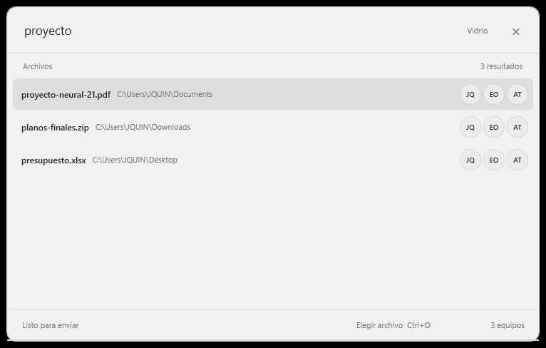
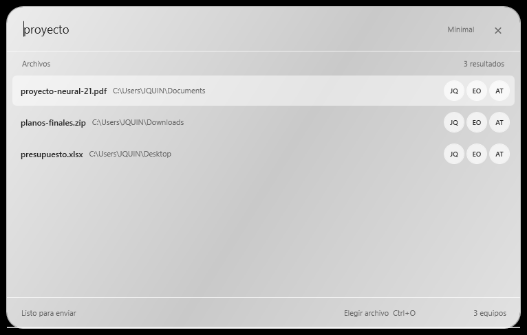

# Lazo

Aplicación para enviar archivos directamente entre equipos Windows 10 y 11 de una misma subred privada. Funciona en segundo plano desde la bandeja y se abre con **doble Alt izquierdo** o **Ctrl+Alt+L**. La ventana se centra en la pantalla donde está el cursor; la alerta de recepción hace lo mismo en el equipo destinatario.

| Minimal (predeterminado) | Vidrio |
| --- | --- |
|  |  |

El botón de la esquina superior derecha cambia de tema y guarda la elección. Minimal tiene una sola barra de búsqueda y filas de archivos; los círculos con iniciales representan equipos disponibles. Vidrio usa la misma disposición con superficies translúcidas.

## Instalar y compartir

Comparte **`dist/Lazo-Setup-0.3.0.exe`**. Es un solo archivo: contiene Lazo, crea accesos directos, registra la desinstalación en Configuración de Windows y configura dos reglas entrantes limitadas al perfil **Privado** y a la **subred local**. Solicita permisos de administrador. Puede iniciar con Windows si se deja marcada la opción del instalador.

1. Cierra cualquier copia anterior de Lazo desde el icono de la bandeja.
2. Ejecuta `Lazo-Setup-0.3.0.exe` y acepta el aviso de Windows.
3. Abre Lazo desde el menú Inicio. Repite la instalación en el otro equipo.
4. Asegúrate de que ambos equipos estén en una red marcada como **Privada** en Windows.

El instalador no tiene firma digital. Windows puede mostrar **Editor desconocido** o SmartScreen al compartirlo fuera de este equipo. Para distribuirlo sin esa advertencia hace falta firmarlo con un certificado de código de confianza. No se incluye ningún certificado ni clave privada en el proyecto.

También puede generarse un paquete portable con `scripts/package.ps1`, pero el instalador es la opción recomendada.

## Usar

1. Abre la ventana con doble Alt izquierdo o `Ctrl+Alt+L`.
2. Escribe parte del nombre del archivo. Lazo consulta el índice local de [Everything](https://www.voidtools.com/support/everything/sdk/ipc/), si está abierto en ese equipo. Muestra hasta 24 archivos por búsqueda. También puedes arrastrar un archivo o usar **Elegir archivo** (`Ctrl+O`), incluso sin Everything.
3. Pulsa las iniciales del destinatario junto al archivo. **Ese clic inicia el envío inmediatamente**. Al pasar el cursor se muestra el nombre completo del equipo.
4. En el receptor aparece una ventana sobre las demás para aceptar o rechazar. La solicitud caduca tras 90 segundos.
5. El archivo aceptado se guarda en `Descargas\Lazo`. Se verifica con SHA-256 antes de conservarlo; la alerta se repliega al terminar.

Cerrar la ventana principal la oculta en la bandeja. **Salir** en el menú de la bandeja detiene Lazo.

## Red y requisitos

Lazo anuncia su presencia por UDP `48351` y transfiere por TCP `48352`. Los nombres aparecen solo si **ambos equipos tienen Lazo abierto**, están en la misma subred IPv4 privada y el firewall permite la conexión. No usa carpetas compartidas ni permisos SMB. Una red Wi‑Fi con aislamiento entre clientes puede impedir el descubrimiento.

La búsqueda rápida requiere Everything instalado y ejecutándose en el equipo que envía. Lazo no instala Everything ni copia su base de datos; consulta su índice mediante IPC local. Los resultados dependen de las carpetas que Everything tenga indexadas. El receptor no necesita Everything.

Requiere .NET Framework 4.8 o superior. El ejecutable se compiló y probó en Windows 11; la validación entre dos equipos físicos, incluida Windows 10, sigue pendiente.

## Desarrollo y verificación

No requiere SDK de .NET ni paquetes NuGet en el equipo de desarrollo; usa el compilador de .NET Framework.

```powershell
.\scripts\build.ps1 -Release
.\scripts\test-everything.ps1
.\scripts\test-network.ps1
.\scripts\build-installer.ps1
.\scripts\test-installer.ps1
```

`test-everything.ps1` comprueba la consulta y respuesta Unicode contra un servidor IPC simulado. `test-network.ps1` hace una transferencia real a una IP privada del propio equipo y compara el archivo recibido. `test-installer.ps1` comprueba el ejecutable incluido. La conexión de búsqueda con una instancia activa de Everything aún debe comprobarse en una sesión de escritorio normal: la instancia instalada en este entorno no expone su ventana IPC a la sesión de prueba.

## Alcance de esta versión

- Un archivo por envío, hasta 20 GB; una recepción activa a la vez.
- El protocolo aún **no cifra ni autentica** equipos. El nombre del remitente puede suplantarse. Utiliza Lazo solo en redes de confianza y verifica el remitente y su IP antes de aceptar.
- Doble Alt deja intacto el comportamiento normal de Alt en otras aplicaciones; alguna puede activar su menú tras el primer toque. `Ctrl+Alt+L` queda como alternativa.
- El instalador y el ejecutable son para Windows. No hay actualización automática.
